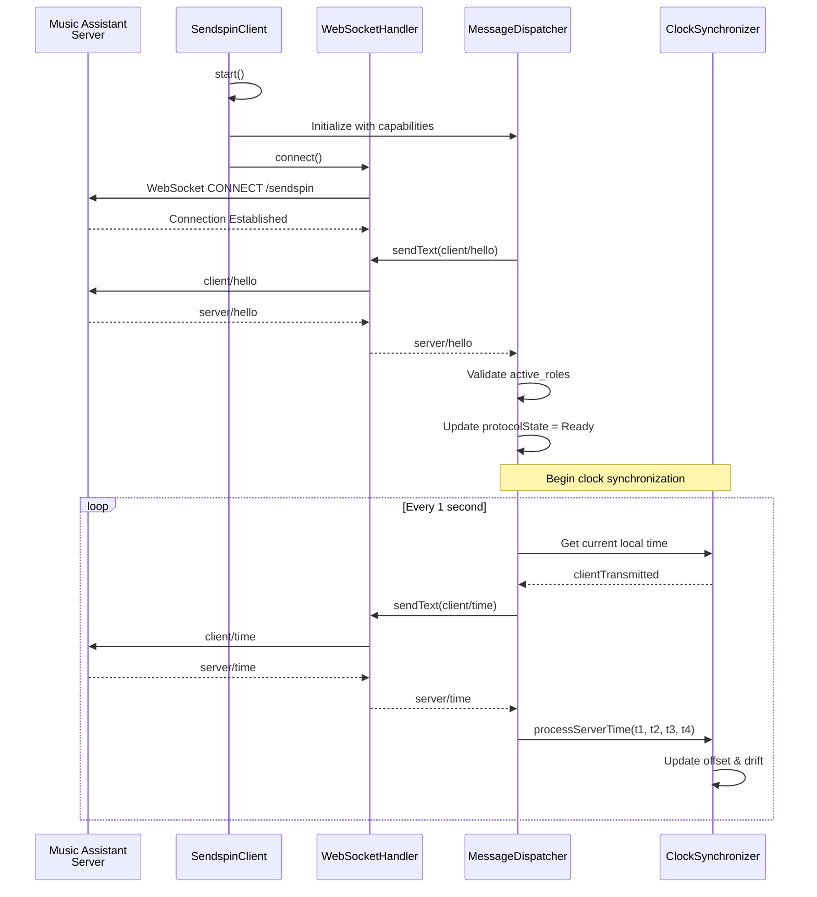
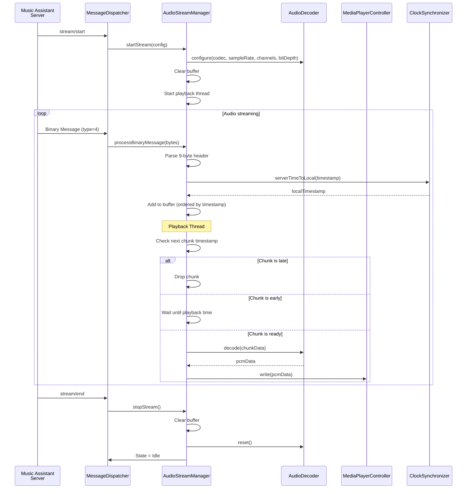
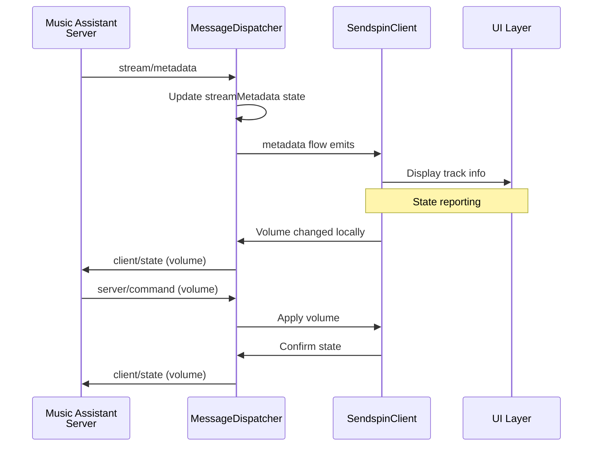
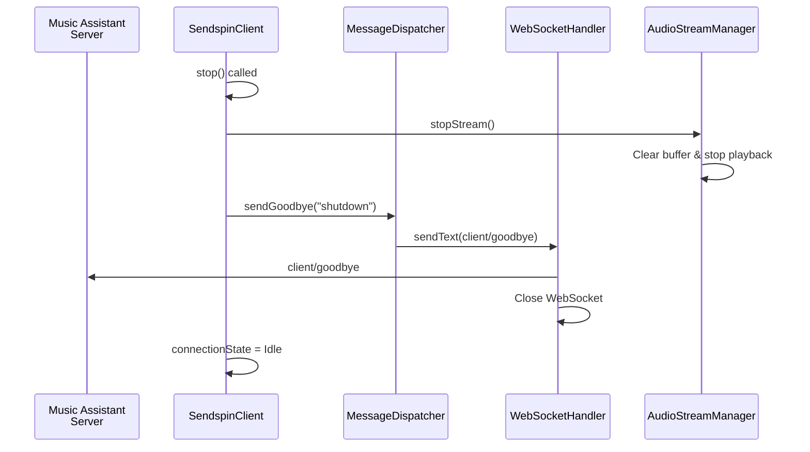

# Sendspin Protocol Integration - Technical Design Document

## Executive Summary

This document outlines the technical design for integrating the Sendspin multi-room audio protocol into the Music Assistant Client. The integration will replace the deprecated Music Assistant built-in player functionality with Sendspin protocol support, while retaining the existing `MediaPlayerController` interface for local audio playback.

**Scope**: Single-server implementation (multi-server handling excluded from initial implementation)

**Target Platforms**: Android (primary), iOS, Desktop (JVM)

---

## 1. Architecture Overview

### 1.1 High-Level Architecture

```
┌─────────────────────────────────────────────────────────────────┐
│                     Music Assistant Client                       │
├─────────────────────────────────────────────────────────────────┤
│                                                                   │
│  ┌─────────────────────────┐      ┌───────────────────────────┐ │
│  │  Music Assistant API    │      │   Sendspin Client         │ │
│  │  (WebSocket - existing) │      │   (WebSocket - new)       │ │
│  └──────────┬──────────────┘      └───────────┬───────────────┘ │
│             │                                   │                 │
│             │                     ┌─────────────┴───────────┐     │
│             │                     │  mDNS Advertiser        │     │
│             │                     │  (_sendspin._tcp:8927)  │     │
│             │                     └─────────────────────────┘     │
│             │                                   │                 │
│             │                     ┌─────────────┴───────────┐     │
│             │                     │  Protocol Handler       │     │
│             │                     │  • Message Dispatcher   │     │
│             │                     │  • State Machine        │     │
│             │                     │  • Clock Synchronizer   │     │
│             │                     └─────────────┬───────────┘     │
│             │                                   │                 │
│             │                     ┌─────────────┴───────────┐     │
│             │                     │  Audio Stream Manager   │     │
│             │                     │  • Binary Parser        │     │
│             │                     │  • Timestamp Buffer     │     │
│             │                     │  • Codec Decoder        │     │
│             │                     └─────────────┬───────────┘     │
│             │                                   │                 │
│             └───────────────┬───────────────────┘                 │
│                             │                                     │
│                   ┌─────────▼─────────┐                           │
│                   │ MediaPlayerController (existing interface)    │
│                   │ • prepare() / start() / pause() / stop()      │
│                   └─────────┬─────────┘                           │
│                             │                                     │
└─────────────────────────────┼─────────────────────────────────────┘
                              │
                   ┌──────────▼──────────┐
                   │  Platform Audio API  │
                   │  • Android: ExoPlayer/AudioTrack              │
                   │  • iOS: AVAudioPlayer                         │
                   │  • Desktop: JVM Audio                         │
                   └─────────────────────┘
```

### 1.2 Design Principles

1. **Separation of Concerns**: Sendspin protocol logic separate from audio playback
2. **Platform Abstraction**: Use expect/actual for platform-specific code (mDNS, codecs)
3. **State Management**: Clear state machines for connection and playback states
4. **Reuse Existing**: Keep `MediaPlayerController` interface unchanged
5. **Testability**: Each component independently testable

---

## 2. Component Design

### 2.1 SendspinClient (Main Orchestrator)

**Responsibilities:**
- Lifecycle management of all Sendspin components
- Coordination between discovery, connection, and playback
- Public API for application layer

**Interface:**
```kotlin
class SendspinClient(
    private val platformContext: PlatformContext,
    private val clientId: String,
    private val deviceName: String
) {
    // Lifecycle
    suspend fun start()
    suspend fun stop()

    // State observation
    val connectionState: StateFlow<SendspinConnectionState>
    val playbackState: StateFlow<SendspinPlaybackState>
    val metadata: StateFlow<StreamMetadataPayload?>

    // Control (for controller role - future)
    suspend fun sendCommand(command: String, value: CommandValue?)

    // Internal components
    private val mdnsAdvertiser: MdnsAdvertiser
    private val webSocketHandler: WebSocketHandler
    private val messageDispatcher: MessageDispatcher
    private val audioStreamManager: AudioStreamManager
    private val clockSynchronizer: ClockSynchronizer
}
```

**States:**
```kotlin
sealed class SendspinConnectionState {
    object Idle : SendspinConnectionState()
    object Advertising : SendspinConnectionState()
    data class Connected(
        val serverId: String,
        val serverName: String,
        val connectionReason: ConnectionReason
    ) : SendspinConnectionState()
    data class Error(val error: Throwable) : SendspinConnectionState()
}

sealed class SendspinPlaybackState {
    object Idle : SendspinPlaybackState()
    object Buffering : SendspinPlaybackState()
    data class Playing(val timestamp: Long) : SendspinPlaybackState()
    object Synchronized : SendspinPlaybackState()
    data class Error(val reason: String) : SendspinPlaybackState()
}
```

### 2.2 MdnsAdvertiser (Platform-Specific)

**Responsibilities:**
- Advertise service on `_sendspin._tcp.local.`
- Listen for incoming server connections
- Provide connection callbacks

**Common Interface:**
```kotlin
expect class MdnsAdvertiser(
    serviceName: String,
    port: Int
) {
    suspend fun start()
    fun stop()

    val incomingConnections: Flow<ServerConnectionRequest>
}

data class ServerConnectionRequest(
    val serverHost: String,
    val serverPort: Int
)
```

**Android Implementation:**
```kotlin
actual class MdnsAdvertiser actual constructor(
    serviceName: String,
    port: Int
) {
    private val nsdManager: NsdManager
    private val registrationListener: NsdManager.RegistrationListener

    // Implementation using android.net.nsd.NsdManager
}
```

**iOS Implementation:**
```kotlin
actual class MdnsAdvertiser actual constructor(
    serviceName: String,
    port: Int
) {
    // Implementation using Bonjour (NetService)
}
```

**Desktop Implementation:**
```kotlin
actual class MdnsAdvertiser actual constructor(
    serviceName: String,
    port: Int
) {
    // Implementation using JmDNS library
}
```

### 2.3 WebSocketHandler

**Responsibilities:**
- Maintain WebSocket connection to `/sendspin` endpoint
- Handle binary and text message frames
- Automatic reconnection logic
- Message sending with proper serialization

**Interface:**
```kotlin
class WebSocketHandler(
    private val serverUrl: String
) {
    suspend fun connect()
    suspend fun disconnect()

    // Message flows
    val textMessages: Flow<String>
    val binaryMessages: Flow<ByteArray>
    val connectionState: StateFlow<WebSocketState>

    // Sending
    suspend fun sendText(message: String)
    suspend fun sendBinary(data: ByteArray)

    private val client: HttpClient
    private var session: DefaultClientWebSocketSession?
}

sealed class WebSocketState {
    object Disconnected : WebSocketState()
    object Connecting : WebSocketState()
    object Connected : WebSocketState()
    data class Error(val error: Throwable) : WebSocketState()
}
```

**Implementation Notes:**
- Use Ktor WebSockets (already in project)
- Handle both TEXT and BINARY frames
- Exponential backoff for reconnection
- Graceful shutdown with `client/goodbye`

### 2.4 MessageDispatcher

**Responsibilities:**
- Parse incoming messages (JSON text messages)
- Route messages to appropriate handlers
- Serialize and send outgoing messages
- Maintain protocol state machine

**Interface:**
```kotlin
class MessageDispatcher(
    private val webSocketHandler: WebSocketHandler,
    private val clockSynchronizer: ClockSynchronizer,
    private val audioStreamManager: AudioStreamManager,
    private val clientCapabilities: ClientHelloPayload
) {
    suspend fun start()
    fun stop()

    // State
    val protocolState: StateFlow<ProtocolState>
    val serverInfo: StateFlow<ServerHelloPayload?>
    val streamMetadata: StateFlow<StreamMetadataPayload?>

    // Outgoing messages
    suspend fun sendHello()
    suspend fun sendTime()
    suspend fun sendState(state: PlayerStateObject)
    suspend fun sendGoodbye(reason: String)

    // Message handlers (internal)
    private suspend fun handleServerHello(message: ServerHelloMessage)
    private suspend fun handleServerTime(message: ServerTimeMessage)
    private suspend fun handleStreamStart(message: StreamStartMessage)
    private suspend fun handleStreamEnd(message: StreamEndMessage)
    private suspend fun handleStreamClear(message: StreamClearMessage)
    private suspend fun handleStreamMetadata(message: StreamMetadataMessage)
    private suspend fun handleServerCommand(message: ServerCommandMessage)
}

sealed class ProtocolState {
    object Disconnected : ProtocolState()
    object AwaitingServerHello : ProtocolState()
    data class Ready(val activeRoles: List<VersionedRole>) : ProtocolState()
    object Streaming : ProtocolState()
}
```

### 2.5 AudioStreamManager

**Responsibilities:**
- Parse binary audio messages
- Manage timestamp-ordered buffer
- Decode audio based on codec
- Feed decoded audio to MediaPlayerController
- Handle synchronization and late/early chunks

**Interface:**
```kotlin
class AudioStreamManager(
    private val clockSynchronizer: ClockSynchronizer,
    private val mediaPlayerController: MediaPlayerController
) {
    // Stream control
    suspend fun startStream(config: StreamStartPlayer)
    suspend fun clearStream()
    suspend fun stopStream()

    // Audio data
    suspend fun processBinaryMessage(data: ByteArray)

    // State
    val bufferState: StateFlow<BufferState>
    val playbackPosition: StateFlow<Long>

    // Internal components
    private val audioBuffer: TimestampOrderedBuffer
    private var audioDecoder: AudioDecoder?
    private val playbackThread: PlaybackThread
}

data class BufferState(
    val bufferedDuration: Long, // microseconds
    val isUnderrun: Boolean,
    val droppedChunks: Int
)

// Timestamp-ordered priority queue
class TimestampOrderedBuffer {
    private val queue = PriorityQueue<AudioChunk>(compareBy { it.timestamp })

    fun add(chunk: AudioChunk)
    fun peek(): AudioChunk?
    fun poll(): AudioChunk?
    fun clear()
    fun size(): Int
}

data class AudioChunk(
    val timestamp: Long, // server microseconds
    val data: ByteArray,
    val localTimestamp: Long // converted to local time
)
```

**Playback Flow:**
```kotlin
class PlaybackThread(
    private val buffer: TimestampOrderedBuffer,
    private val decoder: AudioDecoder,
    private val mediaPlayer: MediaPlayerController,
    private val clockSync: ClockSynchronizer
) {
    suspend fun start() {
        while (isActive) {
            val chunk = buffer.peek() ?: continue

            val currentLocalTime = getCurrentLocalMicros()
            val chunkPlaybackTime = clockSync.serverTimeToLocal(chunk.timestamp)

            when {
                chunkPlaybackTime < currentLocalTime - LATE_THRESHOLD -> {
                    // Drop late chunk
                    buffer.poll()
                    metrics.droppedChunks++
                }
                chunkPlaybackTime > currentLocalTime + EARLY_THRESHOLD -> {
                    // Wait for chunk time
                    delay(calculateDelay(chunkPlaybackTime, currentLocalTime))
                }
                else -> {
                    // Play chunk now
                    val decoded = decoder.decode(chunk.data)
                    mediaPlayer.write(decoded)
                    buffer.poll()
                }
            }
        }
    }

    companion object {
        const val LATE_THRESHOLD = 100_000L // 100ms in microseconds
        const val EARLY_THRESHOLD = 1_000_000L // 1s buffer
    }
}
```

### 2.6 AudioDecoder (Platform-Specific)

**Responsibilities:**
- Decode audio frames based on codec
- Convert to PCM format for MediaPlayerController

**Common Interface:**
```kotlin
interface AudioDecoder {
    fun configure(config: AudioFormatSpec, codecHeader: String?)
    fun decode(encodedData: ByteArray): ByteArray
    fun reset()
    fun release()
}

expect class PcmDecoder() : AudioDecoder
expect class FlacDecoder() : AudioDecoder
expect class OpusDecoder() : AudioDecoder
```

**PCM Decoder (Simple Pass-Through):**
```kotlin
actual class PcmDecoder : AudioDecoder {
    override fun decode(encodedData: ByteArray): ByteArray {
        // PCM is already decoded, just return
        return encodedData
    }
}
```

**FLAC Decoder (Platform-Specific):**
- Android: Use libFLAC JNI bindings or pure Kotlin decoder
- iOS: Use Core Audio / AudioToolbox
- Desktop: Use javax.sound or external library

**OPUS Decoder (Platform-Specific):**
- Android: Use libopus JNI bindings
- iOS: Use AudioToolbox
- Desktop: Use JNI bindings to libopus

---

## 3. Message Flow Diagrams

### 3.1 Connection Handshake



### 3.2 Stream Start and Audio Playback



### 3.3 Metadata and State Updates



### 3.4 Disconnection Flow



---

## 4. State Machines

### 4.1 Protocol State Machine

```
                     ┌──────────────┐
                     │ Disconnected │
                     └──────┬───────┘
                            │ connect()
                            ▼
                 ┌─────────────────────┐
                 │ AwaitingServerHello │
                 └──────────┬──────────┘
                            │ receive server/hello
                            ▼
                     ┌─────────────┐
                     │    Ready    │◄──────┐
                     └──────┬──────┘       │
                            │              │ stream/end
                            │ stream/start │
                            ▼              │
                     ┌─────────────┐       │
                     │  Streaming  │───────┘
                     └─────────────┘
```

### 4.2 Playback State Machine

```
                     ┌──────────┐
                     │   Idle   │
                     └────┬─────┘
                          │ stream/start
                          ▼
                   ┌────────────┐
                   │ Buffering  │
                   └─────┬──────┘
                         │ buffer >= threshold
                         ▼
                   ┌────────────┐
                   │  Playing   │
                   └─────┬──────┘
                         │ sync quality = GOOD
                         ▼
                 ┌───────────────┐
                 │ Synchronized  │
                 └───────┬───────┘
                         │
                ┌────────┼────────┐
                │                 │
                │ underrun        │ stream/end
                ▼                 ▼
          ┌──────────┐      ┌──────────┐
          │  Error   │      │   Idle   │
          └──────────┘      └──────────┘
```

---

## 5. Data Structures and Models

### 5.1 Client Capabilities

```kotlin
object SendspinCapabilities {
    fun buildClientHello(clientId: String, deviceName: String): ClientHelloPayload {
        return ClientHelloPayload(
            clientId = clientId,
            name = deviceName,
            deviceInfo = DeviceInfo.current,
            version = 1,
            supportedRoles = listOf(
                VersionedRole.PLAYER_V1,
                VersionedRole.METADATA_V1
                // Add ARTWORK_V1, VISUALIZER_V1 later
            ),
            playerV1Support = PlayerSupport(
                supportedFormats = listOf(
                    // Start with PCM
                    AudioFormatSpec(
                        codec = AudioCodec.PCM,
                        channels = 2,
                        sampleRate = 48000,
                        bitDepth = 16
                    ),
                    // Add FLAC, OPUS later
                ),
                bufferCapacity = 500_000, // 500ms in microseconds
                supportedCommands = listOf(
                    PlayerCommand.VOLUME,
                    PlayerCommand.MUTE
                )
            ),
            metadataV1Support = MetadataSupport(
                supportedPictureFormats = emptyList()
            ),
            artworkV1Support = null,
            visualizerV1Support = null
        )
    }
}
```

### 5.2 Configuration Storage

```kotlin
data class SendspinConfig(
    val clientId: String, // Persistent UUID
    val deviceName: String,
    val port: Int = 8927,
    val serviceName: String = "${deviceName}._sendspin._tcp.local.",
    val enabled: Boolean = true
)

// Store in SettingsRepository
class SettingsRepository {
    val sendspinConfig: StateFlow<SendspinConfig?>
    suspend fun updateSendspinConfig(config: SendspinConfig)
}
```

---

## 6. Integration Points

### 6.1 With Existing MediaPlayerController

**Current Interface (Keep Unchanged):**
```kotlin
expect class MediaPlayerController(platformContext: PlatformContext) {
    fun prepare(pathSource: String, listener: MediaPlayerListener)
    fun start()
    fun pause()
    fun stop()
    fun getCurrentPosition(): Long?
    fun getDuration(): Long?
    fun seekTo(seconds: Long)
    fun isPlaying(): Boolean
    fun release()
}
```

**New Usage Pattern for Sendspin:**
Instead of `prepare(pathSource: String)`, the AudioStreamManager will:

1. Create in-memory PCM stream source
2. Use platform-specific AudioTrack/AVAudioPlayer directly
3. OR extend MediaPlayerController with new method:

```kotlin
expect class MediaPlayerController(platformContext: PlatformContext) {
    // Existing methods...

    // New method for raw PCM streaming
    fun prepareRawPcmStream(
        sampleRate: Int,
        channels: Int,
        bitDepth: Int,
        listener: MediaPlayerListener
    )

    fun writeRawPcm(data: ByteArray)
}
```

**Recommendation**: Add `prepareRawPcmStream()` + `writeRawPcm()` to avoid re-architecting existing player.

### 6.2 With Music Assistant API

**Current Flow:**
```
User → MainViewModel → ServiceClient → Music Assistant Server → BuiltinPlayerEvent
```

**New Flow (Sendspin):**
```
User → MainViewModel → SendspinClient (directly, no ServiceClient)
Music Assistant Server → Sendspin Server → SendspinClient → Audio playback
```

**Key Change:**
- Music Assistant server will no longer send `BuiltinPlayerEvent`
- Instead, advertise device via Sendspin
- Music Assistant detects Sendspin player and uses Sendspin protocol

### 6.3 UI Integration

**Update MainViewModel:**
```kotlin
class MainViewModel(
    private val serviceClient: ServiceClient,
    private val sendspinClient: SendspinClient, // NEW
    private val settings: SettingsRepository
) : ViewModel() {

    val sendspinState = sendspinClient.connectionState
    val sendspinMetadata = sendspinClient.metadata
    val sendspinPlaybackState = sendspinClient.playbackState

    init {
        viewModelScope.launch {
            settings.sendspinConfig.collect { config ->
                if (config?.enabled == true) {
                    sendspinClient.start()
                } else {
                    sendspinClient.stop()
                }
            }
        }
    }
}
```

**UI Display:**
Show Sendspin connection status, metadata, and playback state in player UI.

---

## 7. Implementation Phases

### Phase 1: Foundation (Week 1)

**Goal**: Establish basic protocol communication

**Tasks**:
- [ ] Create `WebSocketHandler` with Ktor
- [ ] Implement `MessageDispatcher` with message parsing
- [ ] Add message serialization tests
- [ ] Implement handshake flow (client/hello ↔ server/hello)
- [ ] Unit tests for message handling

**Deliverable**: Can connect to Sendspin server and complete handshake

### Phase 2: Clock Synchronization (Week 2)

**Goal**: Integrate existing clock sync with protocol

**Tasks**:
- [ ] Integrate `ClockSynchronizer` with `MessageDispatcher`
- [ ] Implement periodic `client/time` / `server/time` exchange
- [ ] Add clock quality monitoring
- [ ] Unit tests for timestamp conversion
- [ ] Log sync statistics (offset, RTT, drift)

**Deliverable**: Maintains accurate clock sync with server

### Phase 3: mDNS Discovery - Android (Week 3)

**Goal**: Service advertising on Android

**Tasks**:
- [ ] Create `MdnsAdvertiser` expect/actual interface
- [ ] Implement Android version using `NsdManager`
- [ ] Handle service registration lifecycle
- [ ] Test discovery with Sendspin server
- [ ] Handle errors and retries

**Deliverable**: Android device advertises on network, server can discover and connect

### Phase 4: Audio Streaming - PCM Only (Weeks 4-5)

**Goal**: Receive and play audio

**Tasks**:
- [ ] Implement `AudioStreamManager`
- [ ] Create `TimestampOrderedBuffer`
- [ ] Implement `PcmDecoder` (pass-through)
- [ ] Extend `MediaPlayerController.android.kt` with `writeRawPcm()`
- [ ] Implement `PlaybackThread` with timestamp-based scheduling
- [ ] Handle `stream/start`, `stream/end`, `stream/clear`
- [ ] Buffer underrun/overrun handling
- [ ] Integration tests with real audio

**Deliverable**: Can play PCM audio streams with synchronized timing

### Phase 5: State Management & Commands (Week 6)

**Goal**: Full player role implementation

**Tasks**:
- [ ] Implement volume control (local + server commands)
- [ ] Implement mute control
- [ ] Send `client/state` updates
- [ ] Handle `server/command` messages
- [ ] Metadata display integration
- [ ] Error reporting and recovery

**Deliverable**: Full functional Sendspin player with volume/mute control

### Phase 6: Additional Codecs (Week 7+)

**Goal**: Support FLAC and OPUS

**Tasks**:
- [ ] Implement `FlacDecoder` for Android (JNI or pure Kotlin)
- [ ] Implement `OpusDecoder` for Android (JNI)
- [ ] Codec negotiation in capabilities
- [ ] Format switching support
- [ ] Test with various codec streams

**Deliverable**: Supports PCM, FLAC, and OPUS codecs

### Phase 7: Multi-Platform (Week 8+)

**Goal**: iOS and Desktop support

**Tasks**:
- [ ] Implement `MdnsAdvertiser.ios.kt` (Bonjour)
- [ ] Implement `MdnsAdvertiser.desktop.kt` (JmDNS)
- [ ] Implement `MediaPlayerController.ios.kt` with raw PCM
- [ ] Implement `MediaPlayerController.desktop.kt` with raw PCM
- [ ] Platform-specific codec decoders
- [ ] Cross-platform testing

**Deliverable**: Works on Android, iOS, and Desktop

---

## 8. Technical Considerations

### 8.1 Threading Model

**Coroutines Usage:**
- `Dispatchers.IO`: WebSocket, network, mDNS
- `Dispatchers.Default`: Audio decoding, buffer management
- `Dispatchers.Main`: UI updates (via StateFlow)

**Critical Path:**
- Audio playback thread must be high priority
- Minimize allocations in playback loop
- Use object pools for audio chunks

### 8.2 Buffer Management

**Buffer Sizing:**
```
Target Latency: 100-500ms
Sample Rate: 48000 Hz
Channels: 2
Bit Depth: 16 bits

Bytes per second = 48000 * 2 * 2 = 192,000 bytes/sec
Buffer for 500ms = 96,000 bytes ≈ 100KB
```

**Strategy:**
- Pre-buffer 200-300ms before starting playback
- Maintain 100-500ms buffer during playback
- Drop chunks if buffer > 1 second (too far ahead indicates clock drift)
- Report underruns to server via `client/state` (error)

### 8.3 Clock Synchronization Accuracy

**Requirements:**
- Target: ±10ms synchronization across devices
- Acceptable: ±50ms
- Error state: >100ms

**Existing ClockSynchronizer Analysis:**
- Uses Kalman filter ✓
- Tracks drift ✓
- Quality monitoring ✓
- **Good**: Filters outliers, smooths offset changes
- **Consideration**: Ensure audio timestamps use `serverTimeToLocal()` consistently

### 8.4 Error Handling

**Network Errors:**
- WebSocket disconnect → Attempt reconnection with exponential backoff
- mDNS failure → Retry advertising
- Server not responding → Report error state

**Audio Errors:**
- Decode failure → Skip chunk, log error, continue
- Buffer underrun → Report error state to server, attempt recovery
- Clock sync lost → Pause playback, wait for resync

**State Transitions:**
```kotlin
sealed class SendspinError {
    data class NetworkError(val cause: Throwable) : SendspinError()
    data class ProtocolError(val message: String) : SendspinError()
    data class AudioError(val cause: Throwable) : SendspinError()
    object ClockSyncLost : SendspinError()
}

// Emit via StateFlow<SendspinError?>
```

### 8.5 Performance Optimization

**Critical Paths:**
1. Binary message parsing (9-byte header extraction)
2. Timestamp conversion (clock sync calculation)
3. Audio decoding
4. Buffer insertion (maintain sorted order)

**Optimizations:**
- Use `ByteBuffer` for binary parsing (zero-copy)
- Cache timestamp conversions if within same millisecond
- Use native decoders (JNI) for FLAC/OPUS
- PriorityQueue for buffer (O(log n) insertion)

### 8.6 Testing Strategy

**Unit Tests:**
- Message serialization/deserialization
- Binary message parsing
- Clock synchronization math
- Buffer ordering logic
- State machine transitions

**Integration Tests:**
- WebSocket connection lifecycle
- Full handshake flow
- Audio streaming with mock data
- Clock sync with simulated network delay

**End-to-End Tests:**
- Connect to real Sendspin server
- Play real audio streams
- Measure synchronization accuracy
- Stress test with network instability

---

## 9. File Structure

```
composeApp/src/
├── commonMain/kotlin/io/music_assistant/client/
│   └── player/
│       ├── MediaPlayerController.kt (existing - add writeRawPcm)
│       ├── MediaPlayerListener.kt (existing)
│       └── sendspin/
│           ├── SendspinClient.kt
│           ├── SendspinConfig.kt
│           ├── SendspinCapabilities.kt
│           ├── connection/
│           │   ├── WebSocketHandler.kt
│           │   └── MdnsAdvertiser.kt (expect)
│           ├── protocol/
│           │   ├── MessageDispatcher.kt
│           │   └── ProtocolState.kt
│           ├── audio/
│           │   ├── AudioStreamManager.kt
│           │   ├── TimestampOrderedBuffer.kt
│           │   ├── AudioDecoder.kt (interface)
│           │   ├── PcmDecoder.kt
│           │   ├── FlacDecoder.kt (expect)
│           │   └── OpusDecoder.kt (expect)
│           ├── model/ (existing)
│           │   ├── Messages.kt
│           │   ├── VersionedRole.kt
│           │   ├── AudioCodec.kt
│           │   ├── AudioFormatSpec.kt
│           │   └── Binary.kt
│           └── Sync.kt (existing - ClockSynchronizer)
│
├── androidMain/kotlin/io/music_assistant/client/player/
│   ├── MediaPlayerController.android.kt (extend with writeRawPcm)
│   └── sendspin/
│       ├── connection/
│       │   └── MdnsAdvertiser.android.kt
│       └── audio/
│           ├── FlacDecoder.android.kt
│           └── OpusDecoder.android.kt
│
├── iosMain/kotlin/io/music_assistant/client/player/
│   ├── MediaPlayerController.ios.kt (extend with writeRawPcm)
│   └── sendspin/
│       ├── connection/
│       │   └── MdnsAdvertiser.ios.kt
│       └── audio/
│           ├── FlacDecoder.ios.kt
│           └── OpusDecoder.ios.kt
│
└── desktopMain/kotlin/io/music_assistant/client/player/
    ├── MediaPlayerController.desktop.kt (extend with writeRawPcm)
    └── sendspin/
        ├── connection/
        │   └── MdnsAdvertiser.desktop.kt
        └── audio/
            ├── FlacDecoder.desktop.kt
            └── OpusDecoder.desktop.kt
```

---

## 10. Configuration and Settings

### 10.1 User Settings

**Add to Settings UI:**
```
┌─────────────────────────────────┐
│ Sendspin Player Settings        │
├─────────────────────────────────┤
│ Enable Sendspin Player: [x]     │
│ Device Name: [My Phone______]   │
│ Client ID: abc-123-def (auto)   │
│                                 │
│ Advanced:                       │
│   Port: [8927__]                │
│   Buffer Size: [300ms_]         │
│   Codec Preference:             │
│     ☑ PCM                       │
│     ☑ FLAC                      │
│     ☑ OPUS                      │
│                                 │
│ Status:                         │
│   Connection: Connected         │
│   Server: Music Assistant       │
│   Sync Quality: GOOD (±5ms)     │
│   Buffer: 287ms / 300ms         │
└─────────────────────────────────┘
```

### 10.2 Logging and Debugging

**Log Levels:**
- INFO: Connection events, stream start/stop
- DEBUG: Message traffic, state transitions
- TRACE: Binary chunks, timestamp calculations

**Metrics to Track:**
- Clock offset (μs)
- RTT (μs)
- Buffer fill level (ms)
- Dropped chunks count
- Underrun events
- Decode errors

---

## 11. Security and Privacy

### 11.1 Protocol Security

**Sendspin Protocol Limitations:**
- ❌ No authentication
- ❌ No encryption
- ❌ No authorization

**Mitigations:**
- Only enable on trusted networks
- UI warning when enabling
- Network permissions required
- Optional: VPN/tunnel recommendation

### 11.2 Data Privacy

**Data Transmitted:**
- Device name (user-configurable)
- Client ID (random UUID)
- Device info (manufacturer, model, OS version)
- Audio stream (music content)
- Playback state

**Privacy Considerations:**
- Allow user to set custom device name
- Don't include personal info in device info
- Document what data is transmitted

---

## 12. Future Enhancements

### 12.1 Controller Role

Implement `controller@v1` role to send playback commands:
- Play/Pause/Stop/Next/Previous
- Volume control (group)
- Repeat/Shuffle modes
- Group switching

### 12.2 Artwork Role

Implement `artwork@v1` role to display album art:
- Support JPEG/PNG formats
- Multiple channels (album, artist)
- Efficient image decoding

### 12.3 Visualizer Role

Implement `visualizer@v1` role for audio visualization:
- FFT data processing
- Real-time waveform/spectrum display

### 12.4 Multi-Server Support

Add capability to:
- Track multiple servers
- Prefer server with active playback
- Switch between servers
- Handle `connection_reason` properly

### 12.5 Gapless Playback

- Pre-buffer next track
- Seamless transitions
- `stream/start` without `stream/end`

### 12.6 Advanced Sync

- Adaptive buffer sizing based on network jitter
- Machine learning for drift prediction
- Sub-millisecond accuracy

---

## 13. Success Criteria

### 13.1 Functional Requirements

- ✅ Device advertises via mDNS
- ✅ Server can discover and connect
- ✅ Handshake completes successfully
- ✅ Clock synchronization achieves <50ms accuracy
- ✅ Audio plays with <100ms latency
- ✅ No audible glitches under normal network conditions
- ✅ Volume and mute controls work
- ✅ Metadata displays correctly
- ✅ Graceful error handling and recovery

### 13.2 Performance Requirements

- ✅ Startup time: <2 seconds
- ✅ Reconnection time: <5 seconds
- ✅ Buffer underrun rate: <1% over 1 hour
- ✅ Memory usage: <50MB for audio buffers
- ✅ CPU usage: <10% during playback
- ✅ Network bandwidth: Matches audio stream bitrate

### 13.3 Quality Requirements

- ✅ Code coverage: >80% for core logic
- ✅ No memory leaks
- ✅ Thread-safe concurrent access
- ✅ Proper resource cleanup (sockets, decoders, buffers)
- ✅ Comprehensive error handling
- ✅ Logging for debugging

---

## 14. References

- **Sendspin Protocol Specification**: https://www.sendspin-audio.com/spec/
- **SendSpinDroid Reference Implementation**: https://github.com/chrisuthe/SendSpinDroid
- **Ktor WebSocket Documentation**: https://ktor.io/docs/websocket.html
- **Android NsdManager**: https://developer.android.com/reference/android/net/nsd/NsdManager
- **Kotlin Multiplatform**: https://kotlinlang.org/docs/multiplatform.html

---

## Document Version

- **Version**: 1.0
- **Date**: 2025-12-24
- **Author**: Claude (Music Assistant Client Integration)
- **Status**: Draft for Implementation

---

## Appendix A: Sample Message Flows

### A.1 Complete Startup Sequence

```json
// Client → Server: client/hello
{
  "type": "client/hello",
  "payload": {
    "client_id": "abc-123-def-456",
    "name": "My Android Phone",
    "device_info": {
      "productName": "Pixel 7",
      "manufacturer": "Google",
      "softwareVersion": "Android 14"
    },
    "version": 1,
    "supported_roles": ["player@v1", "metadata@v1"],
    "player@v1_support": {
      "supported_formats": [{
        "codec": "pcm",
        "channels": 2,
        "sample_rate": 48000,
        "bit_depth": 16
      }],
      "buffer_capacity": 500000,
      "supported_commands": ["volume", "mute"]
    },
    "metadata@v1_support": {
      "supported_picture_formats": []
    }
  }
}

// Server → Client: server/hello
{
  "type": "server/hello",
  "payload": {
    "server_id": "music-assistant-123",
    "name": "Music Assistant",
    "version": 1,
    "active_roles": ["player@v1", "metadata@v1"],
    "connection_reason": "discovery"
  }
}

// Client → Server: client/time
{
  "type": "client/time",
  "payload": {
    "client_transmitted": 1234567890
  }
}

// Server → Client: server/time
{
  "type": "server/time",
  "payload": {
    "client_transmitted": 1234567890,
    "server_received": 1234570000,
    "server_transmitted": 1234570100
  }
}
```

### A.2 Stream Start and Binary Audio

```json
// Server → Client: stream/start
{
  "type": "stream/start",
  "payload": {
    "player": {
      "codec": "pcm",
      "sample_rate": 48000,
      "channels": 2,
      "bit_depth": 16,
      "codec_header": null
    },
    "artwork": null,
    "visualizer": null
  }
}

// Server → Client: stream/metadata
{
  "type": "stream/metadata",
  "payload": {
    "title": "Song Title",
    "artist": "Artist Name",
    "album": "Album Name",
    "artwork_url": "https://example.com/art.jpg"
  }
}

// Server → Client: Binary audio chunk
// Bytes: [0x04][timestamp: 8 bytes big-endian][PCM data...]
// Example: 04 00 00 00 00 01 23 45 67 [audio frames...]
```

---

## Appendix B: Clock Synchronization Math

**NTP-style offset calculation:**

```
Given:
  t1 = client_transmitted (client local time when sent)
  t2 = server_received (server time when received)
  t3 = server_transmitted (server time when responded)
  t4 = client_received (client local time when received)

Calculate:
  RTT = (t4 - t1) - (t3 - t2)
  Offset = ((t2 - t1) + (t3 - t4)) / 2

Where:
  Offset = server_time - client_time

To convert server timestamp to local time:
  local_time = server_time - offset

To convert local time to server timestamp:
  server_time = local_time + offset
```

**Kalman Filter Update (simplified):**

```kotlin
// Prediction step
val predictedOffset = offset + (drift * deltaTime)

// Measurement update
val residual = measuredOffset - predictedOffset

// Reject outliers
if (abs(residual) > OUTLIER_THRESHOLD) return

// Correction step
offset = predictedOffset + (smoothingRate * residual)
drift += smoothingRate * (residual / deltaTime)
```

---

*End of Technical Design Document*
